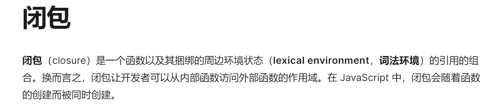

### MDN解释



```
    var name = "The Window";

    function foo() {
        console.log(name); // The Window
    }

    foo();

```

mdn解释说 闭包是一个函数以及捆绑的周围环境（词法环境）的引用的组件。

- 从广义上将， 每个函数都是一个闭包，是一个函数，且关联了全局词法环境


```
function foo() {
      var age = 0;
      function bar() {
        age++;
        console.log(age); 
      }
    }

    const bar = foo();
    bar(); // 1
    bar(); // 2
    bar(); // 3
```
mdn解释说 从内部函数访问外部函数的作用域

- 从狭义上将， 一个内部函数访问了外部函数作用域的内容


### 闭包的使用场景

- 函数柯西化(把一个接收多个参数函数，变成只接收一个参数或者部分参数的函数，剩余的参数有返回的函数接收)

```
  // 普通函数
     function add(x,y,z) {
      return x+y+z;
     }


      // 闭包函数 - 函数柯西化（es5）
      function add(x) {
        return function(y) {
          return function(z) {
            return x+y+z;
          }
        }
      }

      // 闭包函数 - 函数柯西化（es6）
      const add = x => y => z => x+y+z;
```

- 

- 单例模式

- 工厂模式